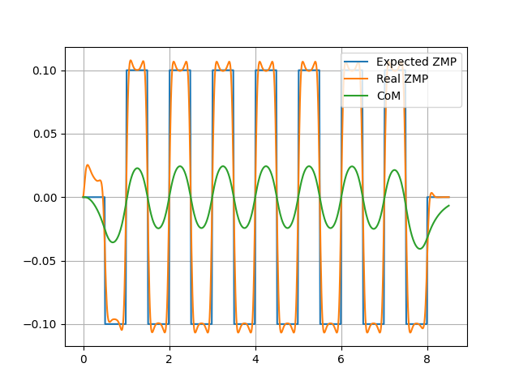
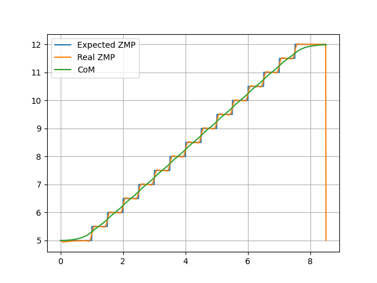
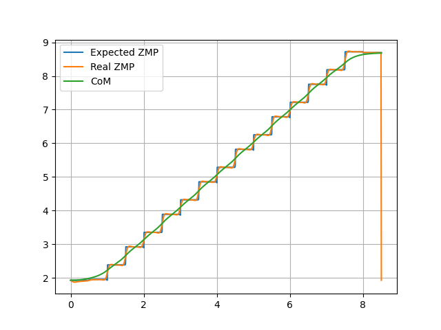
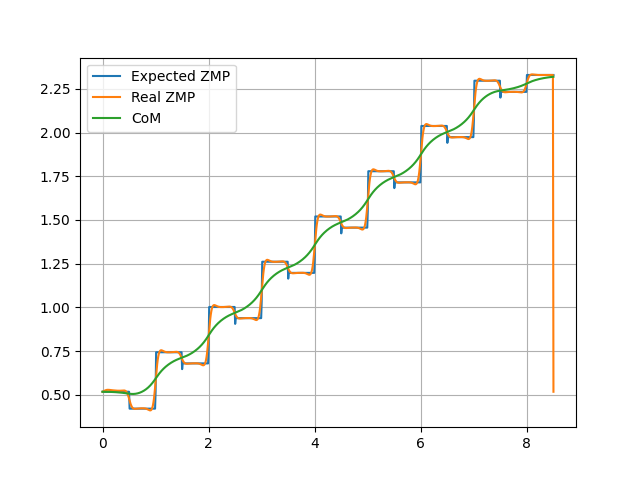

# ZMP_Preview_Control for Biped Robot

This repository contains Python code that utilizes the **ZMP Preview Control** method to generate the Center of Mass (CoM) trajectory and joint angles for a biped robot. It allows customization of the starting point and generation direction for the robot's motion.

### Result examples

| x=0,theta=0       |    |    |
| ----------------- | --------------------------------- | --------------------------------- |
| **x=5,theta=0**   |    |    |
| **x=2,theta=15°** |  |  |

### Requirements

The following Python libraries are required to run the code:

- `numpy` - For numerical calculations.
- `matplotlib` - For visualizing the trajectory and results.
- `scipy` - For solving equations and interpolation.

To install the dependencies, run:

```
pip install -r requirements.txt
```

### Usage

#### 1. Set the Start Point and Direction

To customize the starting point and direction of the generated trajectory, modify the `x_start` and `theta` variables in the configuration section of the code. For example:

```python
x_start = 0  # Starting point for x-coordinate
theta = 0    # Angle relative to the x-axis in radians (counterclockwise)
```

#### 2. Run the Simulation

```
cd src
python Generate.py
```

#### 3. Customizing Parameters

You can also adjust other parameters such as:

- **Step length**
- **Stride duration**
- **ZMP reference points**

[Repository Link](https://github.com/Yourccchen/ZMP_Preview_Control)

### References

1. [Kajita, Shuuji, et al. "Biped walking pattern generation by using preview control of zero-moment point." *2003 IEEE International Conference on Robotics and Automation*](https://ieeexplore.ieee.org/iel5/8794/27834/01241826.pdf)
2. [J. Park and Y. Youm, "General ZMP Preview Control for Bipedal Walking," *Proceedings 2007 IEEE International Conference on Robotics and Automation*](https://ieeexplore.ieee.org/abstract/document/4209488)
3. [《仿人机器人》双足步态的matlab实现](https://zhuanlan.zhihu.com/p/603594171)
